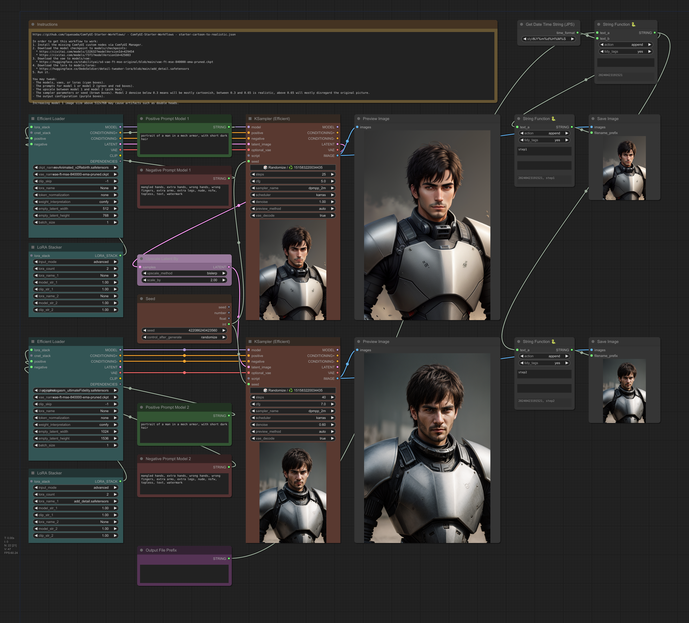

ComfyUI-Starter-Workflows
Copyright (c) 2024, Luis Quesada Torres - https://github.com/lquesada | www.luisquesada.com

A collection of simple but powerful ComfyUI workflows for Stable Diffusion with curated default settings.

Check ComfyUI here: https://github.com/comfyanonymous/ComfyUI

# starter-person.json
A workflow to generate pictures of people and optionally upscale them x4, with the default settings adjusted to obtain good results fast.

Instructions can be found within the workflow.

Drag and drop this screenshot into ComfyUI (or download [starter-person.json](starter-person.json) to pysssss-workflows/):

## Examples
Input (positive prompt): "resume picture, wearing a suit, african woman"

Output:

Input (positive prompt): "portrait, wearing white t-shirt, icelandic man"

Output:

See a full list of examples [here](starter-person_examples/examples.webp). All these examples were generated with seed 1001, the default settings in the workflow, and the prompt being the concatenation of y-label and x-label, e.g. "portrait, wearing white t-shirt, african man".

All the separate high-quality png pictures and the XY Plot workflow can be downloaded from [here](starter-person_examples).

# starter-creative-upscale.json
A workflow to upscale a picture by applying resampling driven by the original picture, both via tags and an IPAdapter or Image Prompt Adapter, plus additional optional positive and negative prompts.

The resulting picture will be a creative reinterpretation of the original picture. It won't be too precise for faces, as it will make up too many details.

Instructions can be found within the workflow.

Drag and drop this screenshot into ComfyUI (or download [starter-creative-upscale.json](starter-creative-upscale.json) to pysssss-workflows/):

## Examples
Input:

Output:

# starter-cartoon-to-realistic.json
A workflow to generate a cartoonish picture using a model and then upscale it and turn it into a realistic one by applying a different checkpoint and optionally different prompts. Cartoonish models are often more creative and produce more varied outputs than realistic ones, therefore this workflow can be used as a source of ideas.

Instructions can be found within the workflow.

Drag and drop this screenshot into ComfyUI (or download [starter-cartoon-to-realistic.json](starter-cartoon-to-realistic.json) to pysssss-workflows/):

## Examples
Input (positive prompt): "portrait of a man in a mech armor, with short dark hair"

Output step 1 (cartoon-ish):

Output step 2 (realistic):

# License
Creative Commons License Attribution-NonCommercial-ShareAlike 3.0 Unported (CC BY-NC-SA 3.0)

This is a human-readable summary of the Legal Code.

You are free:

*   to Share — to copy, distribute and transmit the work
*   to Remix — to adapt the work

Under the following conditions:

*   Attribution — You must attribute the work in the manner specified by the author or licensor (but not in any way that suggests that they endorse you or your use of the work).

*   Noncommercial — You may not use this work for commercial purposes.

*   Share Alike — If you alter, transform, or build upon this work, you may distribute the resulting work only under the same or similar license to this one.

With the understanding that:

*   Waiver — Any of the above conditions can be waived if you get permission from the copyright holder.
*   Public Domain — Where the work or any of its elements is in the public domain under applicable law, that status is in no way affected by the license.
*   Other Rights — In no way are any of the following rights affected by the license:
       Your fair dealing or fair use rights, or other applicable copyright exceptions and limitations;
       The author's moral rights;
       Rights other persons may have either in the work itself or in how the work is used, such as publicity or privacy rights.
*   Notice — For any reuse or distribution, you must make clear to others the license terms of this work. The best way to do this is with a link to this web page.

For details and the full license text, see http://creativecommons.org/licenses/by-nc-sa/3.0/
